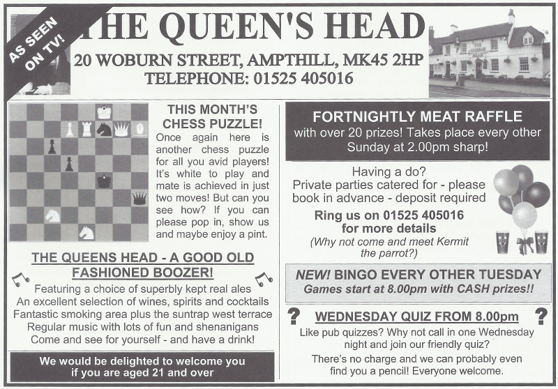
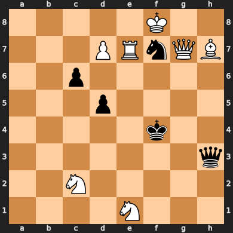

# Table of Contents

-   [Literate Chess Puzzle Solving with Org](#org9d558bc)
    -   [Inspiration](#org31accb9)
    -   [Lichess](#orga7176e8)
    -   [Popeye](#orgc115687)
    -   [Python Chess](#org419695d)
    -   [Org Mode](#org1e5c3ca)
-   [License](#org30fdea5)

# Literate Chess Puzzle Solving with Org

## Inspiration

Every Wednesday in my town, there's a pub quiz at the Queens Head.
Richard, the landlord, runs a very quirky quiz where the prize hardly ever
goes to the best team.  A typical announcement would be, "Totally chosen at
random by a passing Nun, tonight's Star Prize is a Luxury Deluxe bottle of
Prosecco, going to the team that comes third!".

He also takes out adverts for the pub in a local monthly magazine called
The Fuddler.  Every month, along with the advert, there's a mate-in-2 chess
puzzle.  Richard is a chess fan; I don't know where he gets the puzzles
from, but they're always quite fiendish.

In the advert puzzle shown ([4](#org5b5bb8e)), the Black King is hemmed in and can't
move.  All White needs to do is give check, which looks easy: **RxN**, which
also removes the troublesome Knight, and the King still has nowhere to go.
But there's an escape: **Qf5**, blocking the Rook check.  The Rook can simply
take the Queen, giving check again, but now Black has another escape move:
**Ke4**, since the Bishop is now blocked by the Rook.

And that's as far as I got with this one.

This happens a lot.  Even if I think I've worked out the answer, I'm never
completely sure I haven't missed something.  And, slightly annoyingly,
there's never any answer to the puzzle in the next issue.  But I'd like to
know what I've missed, mainly to get that "Aha!" moment.  So&#x2026; I decided
to find some tools to help.

## Lichess

The first thing I looked at was [Lichess](https://lichess.org), which is a great free online chess
tool, and accepts board positions in [FEN](https://en.wikipedia.org/wiki/Forsyth%E2%80%93Edwards_Notation) format.  For the puzzle above, the
FEN format is:

    5K2/3PRnQB/2p5/3p4/5k2/7q/2N5/4N3 w - - 0 1

You can get it to set up the position like [this](https://lichess.org/analysis/standard/5K2/3PRnQB/2p5/3p4/5k2/7q/2N5/4N3#0).  If you turn on Stockfish
analysis mode, it will will come up with a mate in 2:

    1. Ne3
    2. Qf5  N3g2#

Hmm.  OK, that's mate, but what if Black had done something different?  I
couldn't figure out how to get any alternative Black moves; maybe I was
missing something.  Lichess has an [API](https://lichess.org/api), but it doesn't seem to have
anything to help solve chess puzzles.

## Popeye

Looking around some more, I found another option: [Popeye](https://www.chessprogramming.org/Popeye).  Not the sailor,
but a standalone program specifically for solving chess puzzles.  After
installing it, and reading just enough of the arcane [manual](https://raw.githubusercontent.com/thomas-maeder/popeye/master/py-engl.txt) to figure out
how to encode the puzzle, I cobbled together this input:

    Begin
    Origin       Fuddler, November 2022
    Pieces       White Se1 Sc2 Pd7 Re7 Qg7 Bh7 Kf8
                 Black Qh3 Kf4 Pd5 Pc6 Sf7
    Option       NoBoard Variation
    Stipulation  #2
    End

Instead of FEN notation, it lists the Black and White pieces individually
by position.  Strangely, Popeye uses **S** to indicate a Knight instead of
**N**.<a id="fnr.1" class="footref" href="#fn.1" role="doc-backlink">1</a>  It's the `Variation` option which gets all the possible Black
replies; without that, you just get the winning first move.

Feeding it into Popeye, this is what comes out:

    1.Sc2-e3 ! zugzwang.
       1...Qh3-f1
           2.Qg7-g4 #
       1...Qh3-g2
           2.Se3*g2 #
       1...Qh3*d7
           2.Se3-g2 #
       1...Qh3-e6
           2.Se3-g2 #
       1...Qh3-f5
           2.Se3-g2 #
       1...Qh3-g4
           2.Qg7*g4 #
       1...Qh3-h1
           2.Qg7-g4 #
       1...Qh3-h2
           2.Qg7-g4 #
       1...Qh3*e3
           2.Re7*f7 #
       1...Qh3-f3
           2.Se1-d3 #
       1...Qh3-g3
           2.Qg7-f6 #
       1...Qh3*h7
           2.Qg7-g4 #
       1...Qh3-h6
           2.Se3-g2 #
       1...Qh3-h5
           2.Se3-g2 #
       1...Qh3-h4
           2.Se3-g2 #
       1...d5-d4
           2.Re7-e4 #
       1...c6-c5
           2.Se3*d5 #
       1...Sf7-d6
           2.Qg7-e5 #
       1...Sf7-e5
           2.Qg7*e5 #
       1...Sf7-g5
           2.Qg7-e5 #
       1...Sf7-h6
           2.Qg7-e5 #
       1...Sf7-h8
           2.Qg7-e5 #
       1...Sf7-d8
           2.Qg7-e5 #

So the winning move is **Nc2-e3**, which agrees with Lichess.  But now it's a
bit clearer *why*: It leaves Black in a [Zugzwang](https://en.wikipedia.org/wiki/Zugzwang) position such that any of
23 possible moves has a mating reply.  It's safe to say I would not have
worked that out.

Well, Popeye did what I asked it, but I still wasn't happy with the method.
The Popeye input syntax is quite clunky; I much prefer the FEN format used
by Lichess.  And I think the output could be summarized more succinctly, by
grouping the moves by mating reply.  Could I do better?

## Python Chess

I didn't find any other tools specifically for the mate-in-2 problem.  But
I *did* find a Python [chess](https://python-chess.readthedocs.io/en/latest/index.html) module.  Its documentation says it can
manipulate chess boards and positions in various ways, make moves, detect
checkmate, and a bunch of other things.  Sounds good!  Let's have a go with
it.

First, let's see if we can get it to read my puzzle FEN position.

    import chess
    
    fen = "5K2/3PRnQB/2p5/3p4/5k2/7q/2N5/4N3"
    board = chess.Board(fen)
    print(board)

Running this, we get:

    . . . . . K . .
    . . . P R n Q B
    . . p . . . . .
    . . . p . . . .
    . . . . . k . .
    . . . . . . . q
    . . N . . . . .
    . . . . N . . .

Cute.  An ASCII board showing the position.  Digging into the docs a bit
more, it turns out that it can also write SVG files:

    from pathlib import Path
    from chess import svg
    
    Path("fuddler.svg").write_text(svg.board(board))

Here's what the resulting file looks like:

Much nicer!

Looking further at the docs, there's a `Board` property that looks very
useful: `legal_moves`.  It yields all the legal moves from that board
position as `Move` objects.  There are also `push()` and `pop()` methods to
perform (and undo) moves on a board, modifying it in-place.  And finally,
there's an `is_checkmate()` method to see if the side to move on the
`Board` is in checkmate.  This is looking promising!

The first thing to do is to make a way to iterate over the move tree which
(a) returns the move in a human-readable format, and (b) undoes the move
when analysis of that part of the tree is done.  Here's my attempt: the
`make_legal_move()` iterator.  For each legal move it updates the board,
yields the move in [SAN](https://en.wikipedia.org/wiki/Algebraic_notation_(chess)) format, and undoes the move afterwards.

    def make_legal_move(board):
        for move in board.legal_moves:
            try:
                san = board.san(move)
                board.push(move)
                yield san
            finally:
                board.pop()

Let's see if that works for the puzzle board.  It should produce a list of
valid first moves for White.

    import textwrap
    
    moves = ", ".join(make_legal_move(board))
    print(textwrap.fill(moves))

And here's the result:

    Kg8, Ke8, Kxf7, Bg8, Bg6, Bf5, Be4, Bd3, Qh8, Qg8, Qxf7+, Qh6+, Qg6,
    Qf6+, Qg5+, Qe5+, Qg4+, Qd4+, Qg3+, Qc3, Qg2, Qb2, Qg1, Qa1, Re8,
    Rxf7+, Re6, Re5, Re4+, Re3, Re2, Nd4, Nb4, Ne3, Na3, Na1, Nf3, Nd3+,
    Ng2+, d8=Q, d8=R, d8=B, d8=N

Wow, quite a lot of options!  Checking against the board, it does look like
these are all White's valid moves.

OK, the next problem is how to use that to find a mate-in-2 solution to the
puzzle.  After a few iterations and dead ends, here's what I came up with:

    def mate_in_2(fen):
        board = chess.Board(fen)
    
        # Look at all first moves for white.
        for move in make_legal_move(board):
            # Keep track of Black's replies, and White's and mating moves.
            replies = {}
    
            # Does Black have a move that avoids mate?
            avoidmate = False
    
            # Check Black's replies.
            for reply in make_legal_move(board):
                # Is there a mating move from this position?
                canmate = False
                for mating_move in make_legal_move(board):
                    if board.is_checkmate():
                        replies[reply] = mating_move
                        canmate = True
                        break
    
                # If not, Black can escape.
                if not canmate:
                    avoidmate = True
                    break
    
            # If black can't avoid mate, it's a solution.
            if not avoidmate:
                yield move, replies

It takes a FEN position, and for each solution, yields a 2-tuple: the
winning move for White, and a `dict` of possible Black replies, each reply
mapped to the final mating move.  Let's use this to print out the solution
in a chess-style format:

    for move, replies in mate_in_2(fen):
        print(f"1. {move}")
        for reply, mating_move in sorted(replies.items()):
            print(f"1. ... {reply:6} 2. {mating_move}")

    1. Ne3
    1. ... Nd6    2. Qe5#
    1. ... Nd8    2. Qe5#
    1. ... Ne5    2. Qxe5#
    1. ... Ng5    2. Qe5#
    1. ... Nh6    2. Qe5#
    1. ... Nh8    2. Qe5#
    1. ... Qe6    2. N3g2#
    1. ... Qf1    2. Qg4#
    1. ... Qf3    2. Nd3#
    1. ... Qf5    2. N3g2#
    1. ... Qg2    2. N3xg2#
    1. ... Qg3    2. Qf6#
    1. ... Qg4    2. Qxg4#
    1. ... Qh1    2. Qg4#
    1. ... Qh2    2. Qg4#
    1. ... Qh4    2. N3g2#
    1. ... Qh5    2. N3g2#
    1. ... Qh6    2. N3g2#
    1. ... Qxd7   2. N3g2#
    1. ... Qxe3   2. Rxf7#
    1. ... Qxh7   2. Qg4#
    1. ... c5     2. Nxd5#
    1. ... d4     2. Re4#

## TODO Org Mode

# License

    Copyright (c) 2022, Glenn Hutchings <zondo42@gmail.com>
    All rights reserved.
    
    This work is licensed under the Creative Commons Attribution-ShareAlike 4.0
    International License.  To view a copy of this license, visit
    http://creativecommons.org/licenses/by-sa/4.0/ or send a letter to Creative
    Commons, PO Box 1866, Mountain View, CA 94042, USA.

# Footnotes

<a id="fn.1" href="#fnr.1">1</a> At first I thought this was a quirk of Popeye, but no, it's a
standard thing: the **S** is from the German for Knight, *Springer*.
